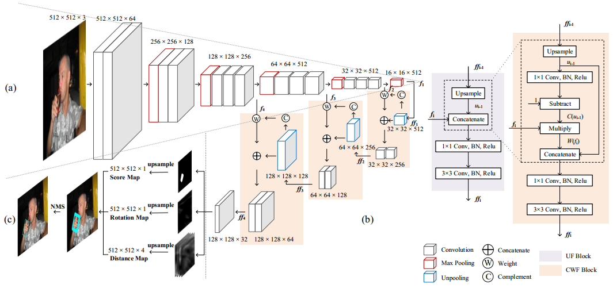
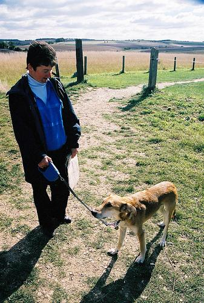

Scale Invariant Fully Convolutional Network: Detecting Hands Efficiently
=====
Introduction
-----
This is a tensorflow implementation of Scale Invariant Fully Convolutional Network: Detecting Hands Efficiently (Accepted to AAAI2019).  
A new Scale Invariant Fully Convolutional Network (SIFCN) trained in an end-to-end fashion is proposed to detect hands efficiently.We design the UF (Unweighted Fusion) block and CWF (Complementary Weighted Fusion) block to fuse features of multiple layers efficiently. The SIFCN architecture with VGG16 backbone: 

### Citation
If you use our code or models, please cite our paper.  

	@inproceedings{DBLP:conf/aaai/LiuDZLWHL19,
      author    = {Dan Liu and
                   Dawei Du and
                   Libo Zhang and
                   Tiejian Luo and
                   Yanjun Wu and
                   Feiyue Huang and
                   Siwei Lyu},
      title     = {Scale Invariant Fully Convolutional Network: Detecting Hands Efficiently},
      booktitle = {The Thirty-Third {AAAI} Conference on Artificial Intelligence},
      pages     = {4344--4351},
      year      = {2019},
      doi       = {10.1609/aaai.v33i01.33014344}
    }

Decription of files
-----
|file/directory|discription|
|--------|--------|
|lanms/                |A C++ version of NMS|
|nets/                 |Contains Resnet V1 model and VGG16 model|
|data_util.py          |A base data generator|
|oxford.py　　　　　    |Data processor for Oxford dataset|
|image_augmentation.py |Various image augmentation methods|
|resnet_v1_model_dice_multi.py                        |ResNet50+UF+Multi-Scale Model|
|resnet_v1_model_dice_multi_weighted_fusion.py        |ResNet50+CWF+Multi-Scale Model|
|vgg16_model_dice_multi.py                            |VGG16+UF+Multi-Scale Model|
|vgg16_model_dice_multi_weighted_fusion.py            |VGG16+CWF+Multi-Scale Model|
|multigpu_train_dice_multi.py                         |Train ResNet50+UF+Multi-Scale Loss|
|multigpu_train_dice_multi_weighted_fusion.py         |Train ResNet50+CWF+Multi-Scale Loss|
|multigpu_train_vgg16_dice_multi.py                   |Train VGG16+UF+Multi-Scale Loss|
|multigpu_train_vgg16_dice_multi_weighted_fusion.py   |Train VGG16+CWF+Multi-Scale Loss|
|eval_all_ckpt_dice_multi.py						  |Evaluate ResNet50+UF+Multi-Scale Loss|
|eval_all_ckpt_dice_multi_weighted_fusion.py		  |Evaluate ResNet50+CWF+Multi-Scale Loss|
|eval_all_ckpt_vgg16_dice_multi.py					  |Evaluate VGG16+UF+Multi-Scale Loss|
|eval_all_ckpt_vgg16_dice_multi_weighted_fusion.py	  |Evaluate VGG16+CWF+Multi-Scale Loss|

Installation
------
Tensorflow > 1.0  
python3  
python packages:  
　　numpy  
　　shapely  
　　opencv-python   

Download
-----
### Data preparing  

[Oxford Hand Dataset](http://www.robots.ox.ac.uk/~vgg/data/hands)  
[VIVA Hand Dataset](http://cvrr.ucsd.edu/vivachallenge/index.php/hands/hand-detection)   

The ground truths should be named exactly the same as the corresponding image such as *VOC2010_1323.jpg* and *VOC2010_1323.txt*. And you are supposed to put the images and ground truths in the same directory. An example image and coresponding gound truth:  

  

	60,269,78,257,87,270,69,283,hand
	118,244,130,245,128,260,116,259,hand
Each line in the ground truth file indicates a hand bounding box. The eight numbers seperated by "," represent the *x* and *y* coordinates of the bounding box in clockwise starting from the upper left. The text "hand" represents the catagory, which is pointless when there is only one catagory.  

### Pre-trained model  

You can download the pre-trained Resnet V1 50 and VGG16 models from the [slim](https://github.com/tensorflow/models/tree/master/research/slim) page.  

Train
-----
You can train the model with the following command:  

	python multigpu_train_dice_multi.py --input_size=512 --batch_size_per_gpu=12 --checkpoint_path=../model/hand_dice_multi_oxford_aug/ --training_data_path=../data/oxford/train/ 	--learning_rate=0.0001 --num_readers=16 --gpu_list=0 --restore=False --pretrained_model_path=../model/resnet50/resnet_v1_50.ckpt

Test
-----
You can evaluate the model with the following command:  

	python eval_all_dice_multi.py --test_data_path=../data/Oxford/test/ --gpu_list=0 --checkpoint_path=../model/hand_dice_multi_oxford_aug/ --output_dir=../result/oxford-test-result/pos/ heatmap_output_dir=../result/oxford-test-result/heatmaps_resenet_dice_multi_oxford/ --no_write_images=True

Troubleshooting
-----
* 
	* 